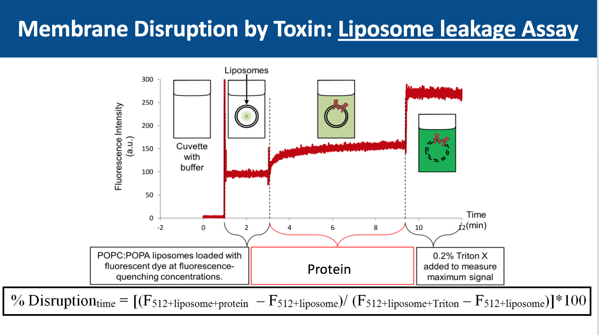
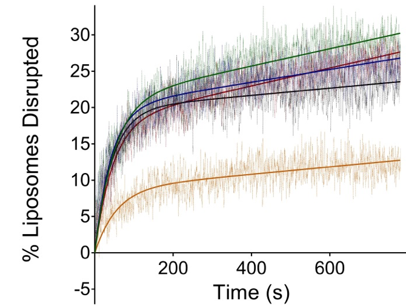
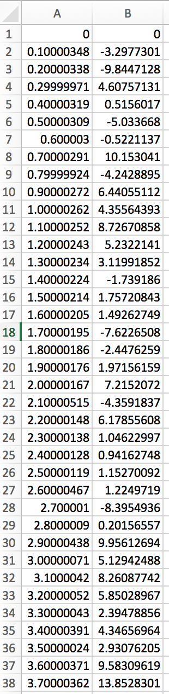
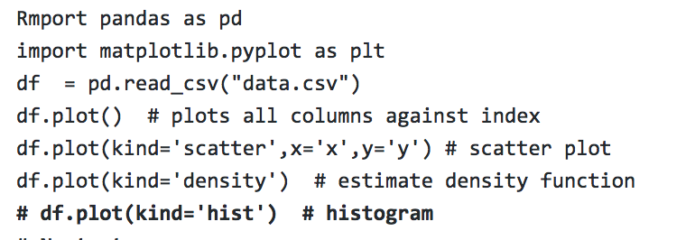

% Analysis of Membrane disruption by a toxin
% John Jimah
% 2018.12.11

# Testing membrane disruption by a toxin
Analyzed data

# Example data of Toxin lysing a membrane

# Example of Unprocessed data

# Scatter plot code

# Next step: 
Fitting and replication

# Acknowledgements
BioF309 class and teachers
